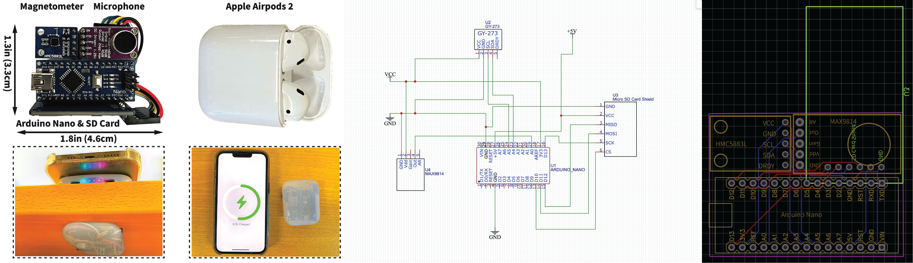

# Artifacts of BankSnoop
Anonymous artifact submission to ACM MobiCom 2023 for paper "Exploiting Contactless Side Channels in Wireless Charging Power Banks for User Privacy Inference via Few-shot Learning"

## Content

* Folder `code`: Python code for developing the CNN-based neural network and the few-shot learning module.

* Folder `datasamples`: Example datasets of coil whine and magnetic field disturbances for developing models.

* Folder `hardware`: Designing schematic of the attacking device and the running code of the magnetometer module.

* Folder `pretrained_models`: Pre-trained models for passcode inference, app launching recognition, and QWERTY keystroke recovery.

## Running Details
The code requires the Python 3.x, Keras 2.3, TensorFlow framework 2.0, and MATLAB 2021b.

* `load_dataset.py`, `load_domain_shift_dataset.py`: Load the source dataset and the domain shift dataset.

* `coilwhine_preprocessing.m`, `data_preprocessing.py`: Pre-processing of the coil whine and captured magnetic traces.

* `MAMLDataLoader.py`: Prepare data for the meta training (K-shot, N-way) process to build the few-shot learning module.

* `MAMLModel.py`, `train_CNN.py`, `meta_training_adaptation.py`: Train the CNN-based recognition models and adapting them to different scenarios.

Pre-trained models for fine-grained user activity recognition.

* `passcode_inference_model.h5`: Model for inferring passcode (from 0 to 9) in the unlocking screen.

* `app_launching_recognition_model.h5`: Model for recognizing 120 popular mobile apps.

* `qwerty_keystroke_inference_model.h5`: Model for recognizing QWERTY keystrokes (from a to z, including the interval key).

## Attacking Device Design

The design and code for running the attacking device is available at folder `hardware`.

* `Gerber_PCB_Attacking_Device.zip`: PCB printing file for the attacking device.

* `Schematic_Attacking_Device.pdf`: Circuit design of the attacking device.

     

Prototype of the attacking device, circuit design, and the PCB producing file.

## Random Testing Sequence in Passcode/Keystroke Recognition

| **L** |    **Test Sequence**    | **L** |            **Test Sequence**           | **L** |    **Test Sequence**    | **L** |            **Test Sequence**           |
|:-----:|:-----------------------:|:-----:|:--------------------------------------:|:-----:|:-----------------------:|:-----:|:--------------------------------------:|
|   1   |       3 6 9       |   6   |       157789 046778 134689       |   1   |       c o e       |   6   |       cpsigw jmuxyz naplok       |
|   2   |      68 59 27     |   7   |      3456689 1224679 0246789     |   2   |      lp di nf     |   7   |      kfjvdxm ntcsbqk pojaemw     |
|   3   |    567 249 013    |   8   |    11667788 23346778 03456689    |   3   |    ajw qsu beg    |   8   |    xnvplwtr gduhryqf abvlmeko    |
|   4   |   4098 3679 0346  |   9   |   013577899 112336689 346777788  |   4   |   rlnp xrqm aybt  |   9   |   iukmgtkbl qnsovknku tcshleyrp  |
|   5   | 01359 13678 24569 |   10  | 0003455678 0235666888 0113455669 |   5   | segra nycod tkmwx |   10  | frxreqvokf ijbsuifxkw mwbtmdntiv |

## Ethical Consideration

<ins>This anonymous repository is used for artifact submission only.</ins> This work takes ethical considerations seriously, and it has been approved by our IRB to collect data from human participants.
In addition, sensitive information, including screen-unlocking passcodes and in-app sensitive user inputs, are generated randomly for effectiveness evaluation only.
The user accounts involved are our own accounts.
BankSnoop and our custom-built attacking device have <ins>NEVER</ins> been released to any other parties.

## Reference

* [MAML-Keras](https://github.com/Runist/MAML-keras)
* [MAML-PyTorch](https://github.com/dragen1860/MAML-Pytorch)
* [Charging Lab](https://www.chargerlab.com/)
