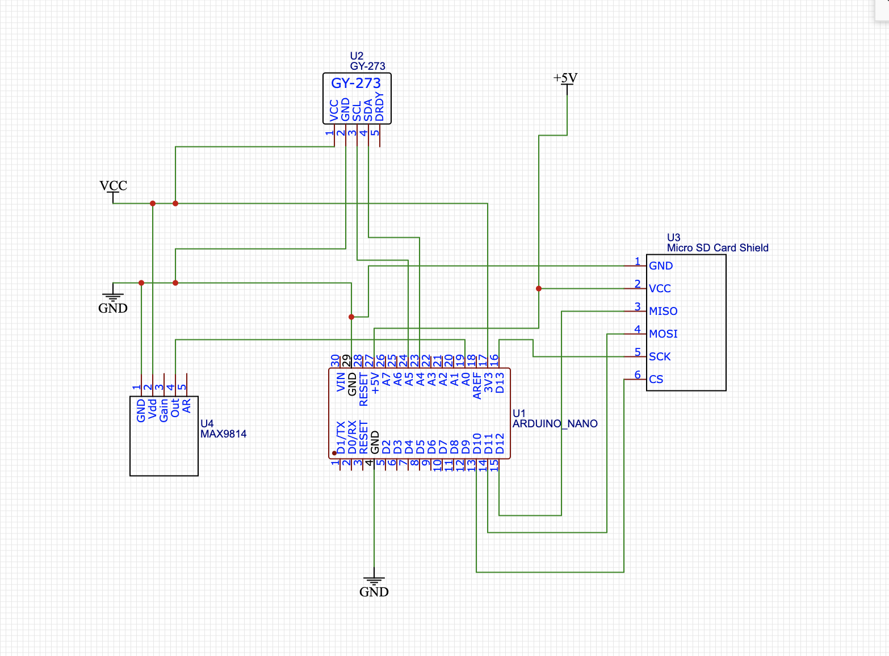
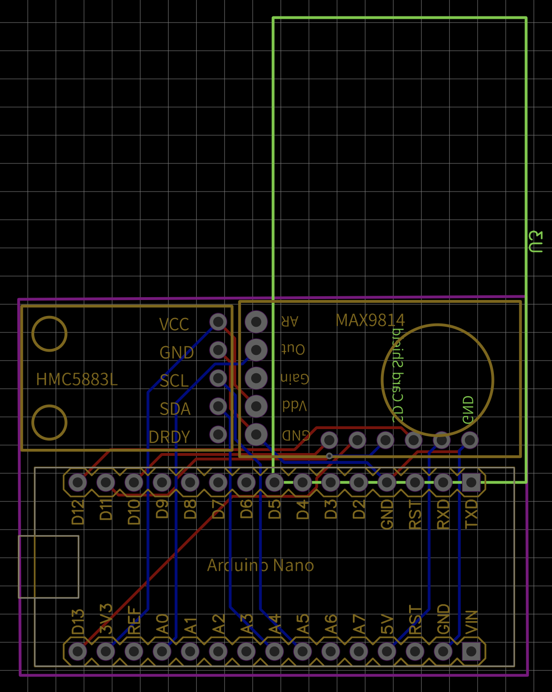

# Artifacts of BankSnoop
Anonymous artifact submission to ACM CCS 2023 for paper "Exploiting Contactless Side Channels in Wireless Charging Power Banks for User Privacy Inference via Few-shot Learning"

## Content

* Folder `code`: Python code for developing the CNN-based neural network and the few-shot learning module.

* Folder `datasamples`: Example datasets of coil whine and magnetic field disturbances for developing models.

* Folder `hardware`: Designing schematic of the attacking device and the running code of the magnetometer module.

* Folder `pretrained_models`: Pre-trained models for passcode inference, app launching recognition, and QWERTY keystroke recovery.

## Running Details
The code requires the Python 3.x, Keras 2.3, TensorFlow framework 2.0, and MATLAB 2021b.

* `load_dataset.py`, `load_domain_shift_dataset.py`: Load the source dataset and the domain shift dataset.

* `coilwhine_preprocessing.m`, `data_preprocessing.py`: Pre-processing of the coil whine and captured magnetic traces.

* `MAMLDataLoader.py`: Prepare data for the meta training (K-shot, N-way) process to build the few-shot learning module.

* `MAMLModel.py`, `train_CNN.py`, `meta_training_adaptation.py`: Train the CNN-based recognition models and adapting them to different scenarios.

Pre-trained models for fine-grained user activity recognition.

* `passcode_inference_model.h5`: Model for inferring passcode (from 0 to 9) in the unlocking screen.

* `app_launching_recognition_model.h5`: Model for recognizing 120 popular mobile apps.

* `qwerty_keystroke_inference_model.h5`: Model for recognizing QWERTY keystrokes (from a to z, including the interval key).

## Attacking Device Design

A | B | C
- | - | -
 |  | 
